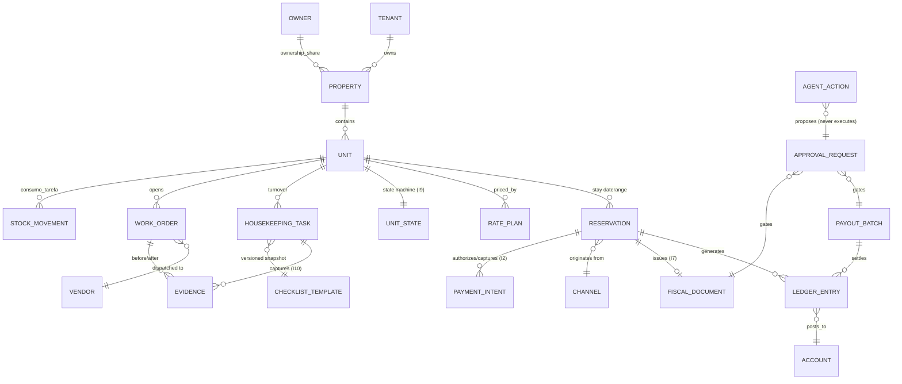
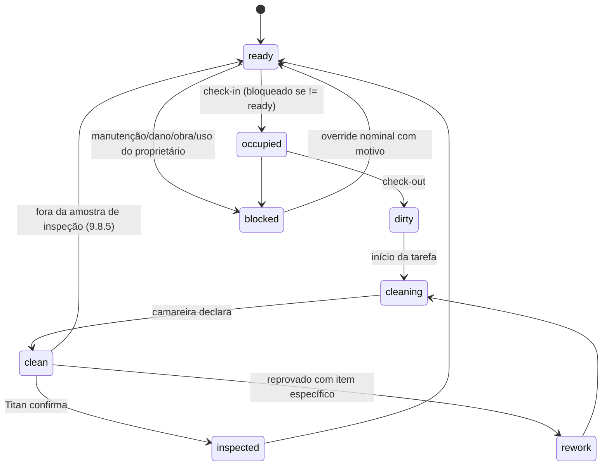
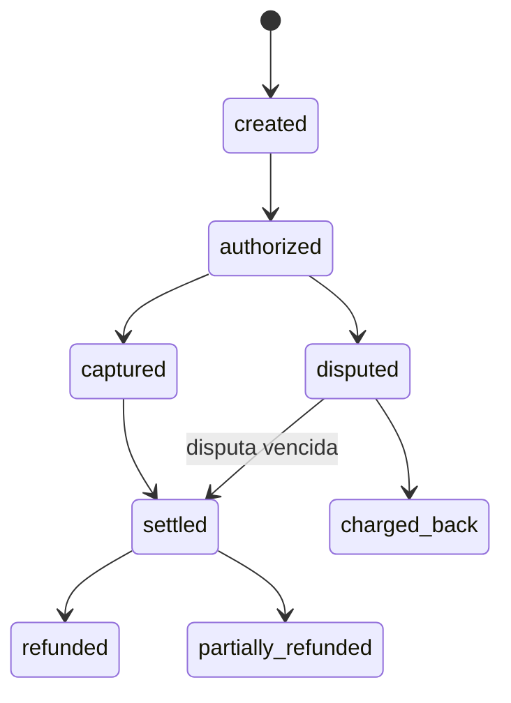

# Modelo de domínio — Rodada 0

Diagramas iniciais dos agregados centrais e das duas máquinas de estado mais críticas (I9 e I2/I6).
Este documento é ponto de partida para o subagente `domain-modeler` na Fase 0 (proprietário de
`packages/domain`, zero I/O) — não é o modelo final, que ganha entidades completas, eventos de
domínio e testes que violam cada invariante.

## 1. Agregados e relações principais

## 2. Máquina de estados da unidade (I9)

## 3. Máquina de estados do pagamento (I2/I6)

## 4. Bounded contexts (referência — seção 6 do prompt único)

`identity` · `inventory` · `availability` · `rates` · `booking` · `distribution` · `payments` ·
`ledger` · `fiscal` · `approvals` · `housekeeping` · `evidence` · `supply` · `vendors` ·
`workforce` · `crm` · `pricing_intel` · `owner_portal` · `analytics`.

Cada um mapeia para `packages/<contexto>/` na Fase 0, com `CLAUDE.md` próprio declarando o que é
proibido naquele pacote e por quê (ex.: `packages/evidence/CLAUDE.md` proíbe qualquer rota de
exclusão — I10; `packages/domain/CLAUDE.md` proíbe qualquer import de I/O).
